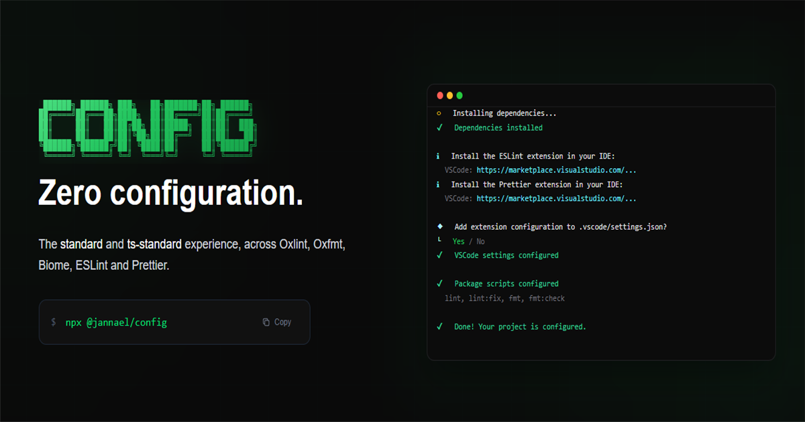

# Config




One command to get your linter and formatter set up.

## Quick Start

```bash
bunx @jannael/config
```

## What is Config?

One command to set up your linter, formatter, editor config, and Husky + lint-staged — you only have to choose your technologies.

It keeps a consistent code style: single quotes, no semicolons, and `printWidth: 150`.

**Available linters:** oxlint, biome, eslint
**Available formatters:** oxfmt, biome, prettier

One of the main goals of `config` is full compatibility across selected technologies. When multiple linters or formatters support all your technologies, it lets you choose which one to use.

## Supported technologies

- Astro
- HTML
- JavaScript
- Lit
- Next.js
- React
- React Native
- Solid
- Tailwind CSS
- TypeScript
- Vue

## License

[MIT](LICENSE)
